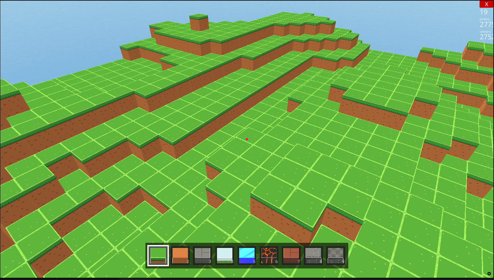

# minecraft-py

A Minecraft-inspired 3D voxel game built with Python and the [Ursina](https://www.ursinaengine.org/) game engine. Explore procedurally generated terrain, place and destroy blocks, and switch between survival and creative flight modes.



## Requirements

- Python 3.12+
- [uv](https://github.com/astral-sh/uv)

## Setup

```bash
uv sync
```

## Run

```bash
uv run start
```

## Controls

| Key            | Action                     |
| -------------- | -------------------------- |
| `W A S D`      | Move                       |
| `Space`        | Jump                       |
| `Double Space` | Toggle creative mode (fly) |
| `Shift`        | Descend (creative mode)    |
| `Left Click`   | Place block                |
| `Right Click`  | Destroy block              |
| `1` – `9`      | Select hotbar slot         |
| `Scroll Wheel` | Cycle hotbar slots         |
| `Esc`          | Pause / Resume             |

## Features

- Procedural terrain generation using Perlin noise
- 9 block types: grass, dirt, stone, snow, ice, lava, brick, gravel, cobblestone
- Isometric block preview in the hotbar
- Face-culling optimization — only exposed block faces are rendered as entities
- Neighbor exposure system — when a block is removed, hidden adjacent blocks are automatically revealed
- Creative mode (fly) with double-tap Space
- Pause menu with Resume and Exit options
- First-person controller with gravity and jump

## Project Structure

```sh
src/
├── main.py         # Entry point, terrain generation, input handling
├── block.py        # Block entity definition and texture registry
├── world_chunk.py  # Neighbor directions constant (NEIGHBORS)
├── hotbar.py       # Hotbar UI with slot selection and block preview
└── pause_menu.py   # ESC pause menu with Resume / Exit
docs/
└── images/
    └── demo.png    # Gameplay screenshot
```

## Architecture

### Face culling

All block data is stored in a flat `world_blocks` dict before any entities are created. Only blocks with at least one air neighbor are spawned as Ursina entities. This reduces the entity count by ~80% compared to spawning every block.

### Hotbar

`Hotbar` renders nine slots at the bottom of the screen. Each slot displays a cropped section of the block texture (x: 318, y: 300, 300 × 300 px) on a quad entity. The selected slot is highlighted with a white border, and `Hotbar.select(index)` updates colors and border visibility without rebuilding any entities.

### Pause menu

`PauseMenu` is always enabled as an Ursina `Entity` so its `input()` method fires with `ignore_paused=True`. Only the visual `menu_parent` container toggles visibility, keeping ESC functional both in-game and while paused.

## Branch protection

| Branch    | Rule                                            |
| --------- | ----------------------------------------------- |
| `main`    | PR required · 1 approval · all checks must pass |
| `develop` | PR required · 1 approval · all checks must pass |

Direct pushes to `main` or `develop` are blocked. Force pushes and branch deletion are disabled.

## License

MIT
